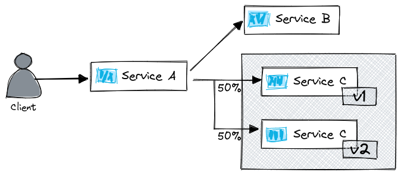

# README

Download [kluster](https://github.com/kameshsampath/kluster/releases)

## Set up a `k3s` kubernetes cluster

```bash
kluster start --profile happy-istio  --cpus=4 --memory=8g --k3s-server-flags="--disable traefik"
```

# Deploy workloads

```bash
kubectl create ns istioinaction

kubectl config set-context $(kubectl config current-context) --namespace=istioinaction

kubectl apply -f services-a.yaml
kubectl apply -f services-b.yaml
kubectl apply -f services-c-v1.yaml

# Wait for services to become ready
kubectl -n istioinaction wait po --for condition=Ready --all
```



Port forward _service-a_:

```shell
kubectl port-forward deploy/service-a 8080
```

Access the app via your browser [http://localhost:8080/ui](http://localhost:8080/ui), or using `curl`:

```shell
repeat 3 curl -Is localhost:8080 | grep HTTP 
```

```shell
HTTP/1.1 200 OK
HTTP/1.1 200 OK
HTTP/1.1 200 OK
```


Now let us deploy _v2_ of _service-c_, this version will introduce some errors with the service and shows how Istio can help to identify and fix real world Distributed Computing fallacies.

```shell
kubectl apply -f services-c-v2.yaml
kubectl -n istioinaction wait po --for condition=Ready --all
```

And now  with,

```shell
repeat 3 curl -Is localhost:8080 | grep HTTP 
```

You will see that some requests fail:

```shell
HTTP/1.1 200 OK
HTTP/1.1 200 OK
HTTP/1.1 500 Internal Server Error
```

> Repeat is only available in `zsh`. Other shells have to use for loops:
>
> ```shell
> for i in {1..5}; do COMMAND; done
> ```

The application is not logging the needed information:

```shell
kubectl logs deploy/service-a | grep -i error
kubectl logs deploy/service-b | grep -i error
kubectl logs deploy/service-c-v1 | grep -i error
kubectl logs deploy/service-c-v2 | grep -i error
```

Our services have some issues. The lack of observability has gotten our happy team confused:


Let's see how istio will help them detect and resolve the issues.

> All services are based on the project [nicholasjackson/fake-service](https://github.com/nicholasjackson/fake-service), which makes it simple to build chains of calls through services. It has a UI to visualize the service call chain. In our instance you can access it at [localhost:8080/ui](http:localhost:8080/ui)

## Install Istio

Set up `istioctl`

```bash
curl -L https://istio.io/downloadIstio | ISTIO_VERSION=1.12.2 TARGET_ARCH=x86_64 sh -

# Move istioctl to your locations pointed by yout PATH env variable
mv istio-1.12.2/bin/istioctl /usr/local/bin/istioctl

# Verify istioctl installation
istioctl version                         
```

__TIP__: Save your time in managing istioctl installs with [asdf-istio](https://github.com/solo-io/asdf-istio)

Install istio:

```shell
istioctl install -y --set profile=demo \
     --set values.global.proxy.privileged=true
```

Output:

```shell
✔ Istio core installed
✔ Istiod installed
✔ Ingress gateways installed
✔ Egress gateways installed
✔ Installation complete
```

> NOTE: We are configuring the proxy to have privileged access, because in the security section we will use tcpdump to sniff the traffic. In production you must not do that.

## Automatic sidecar injection

To enable automatic sidecar injection label the namespace with `istio-injection=enabled`

```shell
kubectl label namespace istioinaction istio-injection=enabled
```

Any newly created pod will get the sidecar. Let's trigger a rollout of the pods so that the newly created ones have the sidecar.

```bash
kubectl rollout restart deploy service-a
kubectl rollout restart deploy service-b
kubectl rollout restart deploy service-c-v1
kubectl rollout restart deploy service-c-v2

# And wait
kubectl -n istioinaction wait po --for condition=Ready --all
```

Verify that the sidecar got injected:

```shell
kubectl get pods
```

In the column `READY` in the output we see the pods have 2 containers. One being the application container, and the other is the injected proxy.

```
NAME                            READY   STATUS    RESTARTS   AGE
service-a-6c5d78f675-k5dqh      2/2     Running   0          18s
service-b-5c669f6df8-l5xnn      2/2     Running   0          18s
service-c-v1-79646f6d65-bvdkx   2/2     Running   0          18s
service-c-v2-64db666896-2nd7h   2/2     Running   0          18s
```

## Manual sidecar injection

Some organizations do not prefer the "magicky" way that the sidecar is injected. Using istioctl the sidecar can be injected manually.

```shell
istioctl kube-inject -f services-a.yaml
```

An abbreviated sample of the output is shown in the figure below.


When using the manual approach you would store the output in a file, and then apply it to the cluster, just as any other workload.

## Istio Ingress Gateway

Istio installs an ingress gateway through which traffic from the public network can be routed to services.

```bash
kubectl get pods -n istio-system

NAME                                    READY   STATUS  
istio-egressgateway-c9cbbd99f-m65hw     1/1     Running 
istio-ingressgateway-7c8bc47b49-47qk7   1/1     Running  #(1)
istiod-765596f7ff-hjpq7                 1/1     Running 
```

(1) The ingress gateway

The ingress gateway can be accessed using its service IP,

```shell
kubectl get svc -n istio-system istio-ingressgateway
```

You configure the ingress gateway to admit traffic into the cluster using the `Gateway` custom resource definition. For example with the custom definition below, we admit traffic in port 8080.

```bash
kubectl apply -n istioinaction -f service-a-gateway.yaml
```

After admitting traffic you configure the routing to services using a `VirtualService` which is another custom resource definition defined by Istio.

Configure the routing of ingress traffic to service-a with the following virtual service:

```bash
kubectl apply -n istioinaction -f service-a-route.yaml
```

Now we have the following set up:


Verify that everything is set up properly by getting the ingress gateway LoadBalancer IP.

Open a new terminal and run continuously running queries:

```shell
export ISTIO_INGRESS_GW_IP=$(kubectl get svc -n istio-system istio-ingressgateway -ojsonpath='{.status.loadBalancer.ingress[*].ip}')
```

```shell
watch -n 1 'curl -s $ISTIO_INGRESS_GW_IP || true'
```

You can also open the ui in the browser with,

```shell
open "http://$ISTIO_INGRESS_GW_IP/ui"
```

Your services should resolve the queries, and we still see the errors.

## Observability

After injecting the sidecar it will generate access logs, metrics, and traces for every request.

## Access logs

To get access logs execute:

```shell
kubectl logs deploy/service-a -c istio-proxy | grep 500
```

A sample log:

```shell
[2022-02-06T17:34:59.493Z] "GET / HTTP/1.1" 500 - via_upstream - "-" 0 1469 4 4 "10.244.0.21" "curl/7.74.0" "26299d2b-fd2a-9d58-bad5-da45e02a4dfc" "localhost:8080" "10.244.0.22:8080" inbound|8080|| 127.0.0.6:57437 10.244.0.22:8080 10.244.0.21:0 outbound_.80_._.service-a.istioinaction.svc.cluster.local default
```

## Metrics

To get the metrics execute:

```bash
kubectl -n istioinaction exec -it deploy/service-a \
    -c istio-proxy -- curl localhost:15020/stats/prometheus \
    | grep istio_requests_total
```

In the output you will see that the response code for the successful requests is `response_code="200"`, meanwhile, for the failed ones it is `response_code="500"`

It's easier to make sense of metrics when those are visualized. Istio provides some sample addons to visualize metrics. Lets deploy the addons.

```bash
kubectl apply -f istio-1.12.2/samples/addons/

# wait for the pods to be ready
kubectl -n istio-system wait po --for condition=Ready --all
```

If you are still generating traffic, the metrics will be swiftly collected by Prometheus and then we can visualize those in Grafana.

Open `grafana` with the command below:

```shell
istioctl dashboard grafana
```

If you navigate to "Istio > Istio Workload Dashboard > Outbound Services" and look into the "Outgoing Success Rate (non-5xx responses) By Destination" you will see which service is failing.


It is service C where requests are failing! The grafana dashboard has even more fine grained information, and you can generate your own dashboards, that can single out pods failing by name. But lets go over to Kiali and see how it uses the metrics collected by prometheus but as well queries the Kube API server to provide more insights.

### Kiali - the service mesh dashboard

To open kiali execute:

```shell
istioctl dashboard kiali
```

Switch over to the graph view and observe which version of the `service-c` is failing the requests? It is the version 2! Next lets use traffic management capabilities and configure traffic routing away from v2 and into v1 of the service.

> Kiali is really powerful, take some more time to learn about its capabilities by exploring the UI, or by reading their documentation (<https://kiali.io/docs/features/>)

The metrics (generated by the service proxies and visualized by Grafana and Kiali,) provide the Service Operator with the insights needed to answer how services are performing. And if there are issues it is easy to isolate which service is faulty without having to fish for bugs across all of the services.

Look at that happy face:


## Traffic Management

The version `v2` of the _service-c_ has a high failure rate. To quickly improve the end-user experience, we can redirect all traffic to the version `v1` of _service-c_. Initially, we need to define subsets using `DestinationRules` as shown below:

```shell
kubectl apply -n istioinaction -f service-c-dr.yaml
```

Now we can make use of the subsets in a virtual service to select the destination to route traffic to:

```bash
kubectl apply -n istioinaction -f service-c-route.yaml
```

If you refresh the web page [localhost:8080/ui](http://localhost:8080/ui) you will discover that all requests are served successfully!

### Mirroring traffic

For the developers to be able to debug the issue we might want to mirror traffic to the erroneous subset. This doesn't impact the client as the responses of the mirrored traffic are ignored.

Update the virtual service to mirror traffic to the erroneous subset.

```shell
kubectl apply -n istioinaction -f service-c-mirror.yaml
```

Validate in Kiali that all requests are resolved successfully, but traffic still reaches the erroneous subset. This is visualized in the "Versioned app graph".

The traffic management capabilities that the service mesh provides previously would require code changes. With Istio a developer can configure many networking behaviors such as retries, timeouts, fine grained routing, weighted routing, and so on (we did cover only mirroring, but those capabilities are [well documented](https://istio.io/latest/docs/reference/config/networking/virtual-service/)).

Now the developer can focus on completing features that provide business value, which makes him happy!


## Security

Traffic between services that are part of the mesh are encrypted. To verify execute the command below:

```bash
kubectl -n istioinaction exec deploy/service-a -c istio-proxy \
     -- sudo tcpdump -l --immediate-mode -vv -s 0 \
     '(((ip[2:2] - ((ip[0]&0xf)<<2)) - ((tcp[12]&0xf0)>>2)) != 0)'
```

You will see an output as the one below:

```shell
10-244-0-23.service-b.istioinaction.svc.cluster.local.http-alt > service-a-6c5d78f675-k5dqh.55988: Flags [P.], cksum 0x1b87 (incorrect -> 0x07ae), seq 1:1357, ack 1361, win 251, options [nop,nop,TS val 3783808996 ecr 519646164], length 1356: HTTP
```

Meanwhile, if we send a request from a legacy workload the traffic is in clear text! Run a legacy service in the default namespace:

```shell
kubectl -n default run legacy --image=radial/busyboxplus:curl -- tail -f /dev/null
```

We can use this service to send a non-mutually authenticated request.

```shell
kubectl -n default exec legacy -- curl -s service-a.istioinaction.svc.cluster.local
```

You will see the entire HTTP information in clear text:

```shell
 service-a-6c5d78f675-k5dqh.http-alt > 10.244.0.31.36682: Flags [P.], cksum 0x1d3f (incorrect -> 0x51e0), seq 1:1789, ack 105, win 255, options [nop,nop,TS val 416275699 ecr 2043301135], length 1788: HTTP, length: 1788
        HTTP/1.1 200 OK
        date: Sun, 06 Feb 2022 18:29:53 GMT
        content-length: 1537
        content-type: text/plain; charset=utf-8
        x-envoy-upstream-service-time: 4
        server: istio-envoy
        x-envoy-decorator-operation: service-a.istioinaction.svc.cluster.local:80/*

        {
          "name": "service-a",
          "owner": "dave",
          "uri": "/",
          "type": "HTTP",
          "ip_addresses": [
            "10.244.0.22"
          ],
        # ...
```

And if you check the Kiali dashboard you could see the traffic from "unknown" is unencrypted(without __lock__ icon)

Because pods might be in different nodes and traffic will travel through many networking devices, a malicious user can read all the sensitive information by sniffing the traffic! It is extremely important to encrypt traffic between workloads!

Istio provides us with the PeerAuthentication resource that defines how services authenticate their peers. Below we create an namespace wide peer authentication resource that strictly requires workloads in the `istioinaction` namespace to mutually authenticate.

```shell
kubectl apply -n istioinaction  -f peer-auth-strict.yaml
```

Now if we execute another request from the legacy workload (i.e. the one without the sidecar that is not mutually authenticating).

```shell
kubectl -n default exec curl -- curl -s service-a.istioinaction.svc.cluster.local
```

It will be rejected with the following output:

```text
command terminated with exit code 56
```

Now the service owners of the `legacy` workload need to migrate it into the mesh, so that it can mutually authenticate and access the other services in the `istioinaction` namespace.

## Reducing access

Authentication is one of the steps to improve the security stance. Another is to reduce the access that is allowed to every service identity.

For example, in our mesh as of now, services are authorized to access all other services (even when not needed).

Try accessing _service-a_ from _service-b_

```shell
# the service-b pod name might differ in your environment
kubectl -n istioinaction exec service-b-69c7bfd899-2pwdp  -- curl -vvv -s service-a.istioinaction.svc.cluster.local
```

And  _service-c_ from _service-b_

```shell
kubectl -n istioinaction exec deploy/service-b -- curl -vvv -s service-c.istioinaction.svc.cluster.local
```

As per our architecture _service-a_ should only be accessed via _istio-ingressgateway_ and _service-a_ should be the only path to call _service-b_ or _service-c_, but thats not the case now which means that if a malicious user gets hold of any of the identities they have free access on all the data!


We can reduce the scope of attack by allowing the least access for every service (i.e. "principle of least privilege").

As per our architecture to make our architecture secured,  _service-a_ should be accessed only from the _istio-ingressgateway_. Let's define that policy:

```shell
kubectl apply -n istioinaction -f ingress-to-service-a-auth-policy.yaml
```

Next, let's allow traffic in `service-b` only from `service-a`:

```shell
kubectl apply -n istioinaction -f service-a-to-b-auth-policy.yaml 
```

And, let's allow access to `service-c` for `service-a` as well.

```shell
kubectl apply -n istioinaction -f service-a-to-c-auth-policy.yaml 
```

Open the page [localhost:8080/ui](http://localhost:8080/ui) and verify that the services are working properly.

Next, verify that you cannot access _service-a_ or _service-b_ from _service-c_.

```shell
kubectl -n istioinaction exec deploy/service-c-v1 -- curl -s service-a.istioinaction.svc.cluster.local
kubectl -n istioinaction exec deploy/service-c-v1 -- curl -s service-b.istioinaction.svc.cluster.local
```

Both queries return:

```shell
RBAC: access denied
```

Because _service-a_ and _service-b_ don't define a policy to admit traffic from _service-c_. Thus malicious users that get hold of the identity of the _service-c_ wouldn't be able to get any data.


With the service-to-service traffic encrypted, a strict mutual-authentication policy, and by implementing the "principle of least privilege" using Authorization Policies, the security engineer feels at ease.


